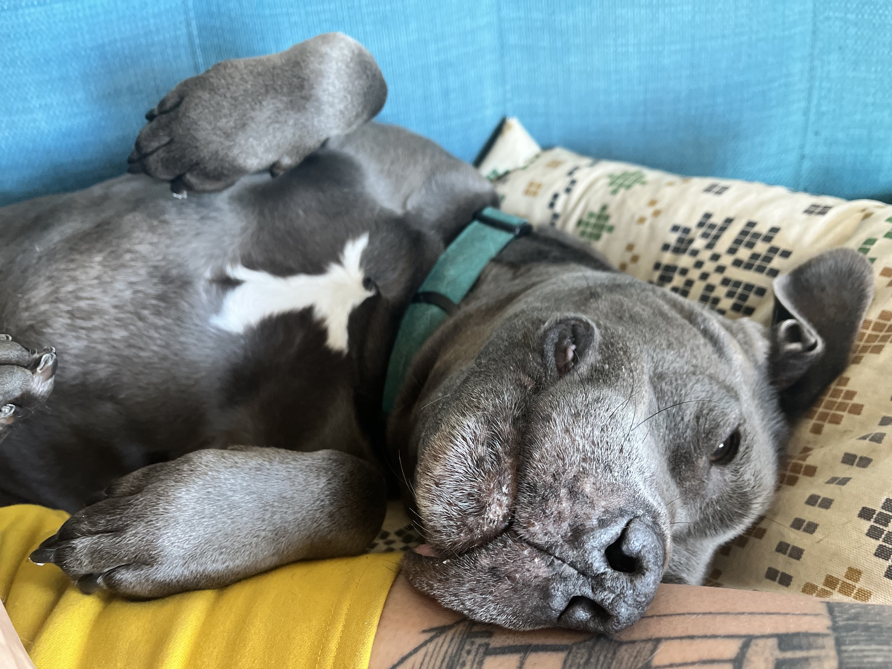

---
# Feel free to add content and custom Front Matter to this file.
# To modify the layout, see https://jekyllrb.com/docs/themes/#overriding-theme-defaults

layout: home
---

Hi, I'm Christa Hartsock.

## professional things

I’m currently the Associate Director of Engineering at the Electronic Frontier Foundation, which is a lot of words to say that I am the manager of a team of software engineers that helps keep EFF running.

I also work as a software engineer and UX researcher on a consulting basis through my company topographic LLC. I'm available for work on interesting projects that move toward a better world—if you have something you'd like to talk about working on together, let's chat (email: christa at topographic.llc).

In the recent past I've worked as:

* a backend software engineer at [Meedan](https://meedan.com/), a non-profit working globally to address misinformation
* a consulting engineer at [18F](https://18f.org/), the US federal government's technology and design consultancy before it was dismantled by DOGE
* an engineering manager, software engineer, and engineering lead at [Code for America](https://codeforamerica.org), working to improve access to criminal record relief as part of [Clear My Record](https://www.codeforamerica.org/programs/clear-my-record), and help ease the burden of getting safety net benefits through the [Integrated Benefits Initiative](https://www.govtech.com/civic/code-for-americas-integrated-benefits-initiative-expands-to-five-states.html) and [GetCalFresh](https://demo.getcalfresh.org).

Prior to working with government, I've worked as an engineer at the agile consultancy Pivotal Labs (RIP) and at another small product consultancy (also RIP); as a studio manager at [Peter Rose and Partners](https://roseandpartners.com/), an architecture and urban design firm; as a travel guide writer in Barcelona, on a variety of cleanup crews; in many ice cream shops; and a number of other things.

## non-professional things

I live in San Francisco with my husband, [Jim Fingal](https://jimfingal.com), and our rescue bully, Piglet.

I mostly spend my time running, biking, gardening, writing, making dumb music. You can listen to some of it by calling 419-452-4857 (no human will pick up, I promise, but you can leave a message if you want).

In the past co-founded and helped run [Logic Magazine](https://logicmag.io), on which I continue on the board, and helped start the [San Francisco Review of Whatever](https://sfreview.org/). I still sometimes help with tech stuf (hardware, software, etc) at [BFF.fm](https://bff.fm/volunteer), a San Francisco community radio station based in the Mission. In some distant past, I spent a lot of time in the dank basement of college radio station [WHRB](https://whrb.org), where I met Jim.

## contact

I exist a few other places:
* email: christa (dot) hartsock (at) gmail (dot) com
* on the fediverse at <a rel="me" href="https://friend.camp/@christa">friend.camp/@christa</a>
* [github](https://github.com/hartsick)
* [linkedin](http://linkedin.com/in/chartsock)
* offline, mostly in San Francisco

If you'd like to talk, shoot me a message via email. I'm often slow at responding, but do have the best intentions. Short, direct asks usually get a response more quickly.

Thanks for visiting; here is a gift:

